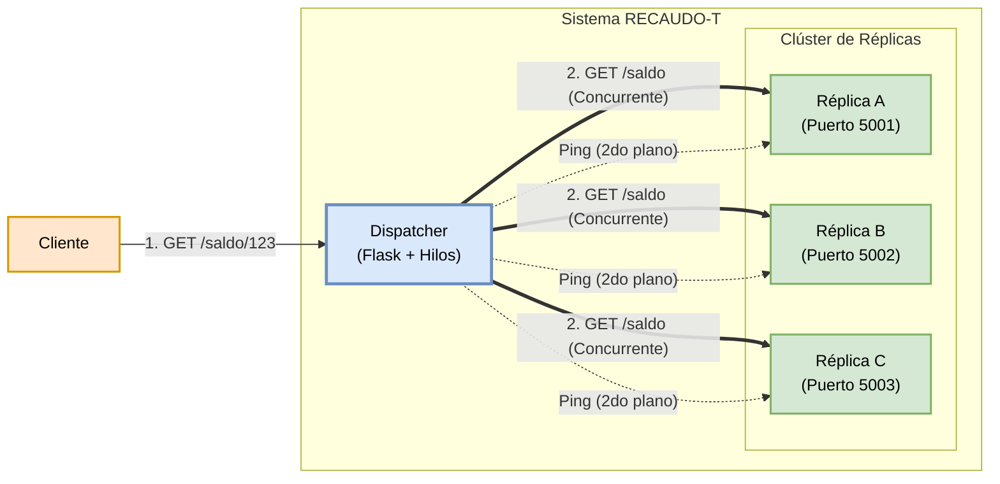

# Diagrama de Arquitectura

Este diagrama detalla la interacción del sistema y la relación de alta disponibilidad entre el Dispatcher central y el grupo de réplicas.

```mermaid
graph LR
    Cliente[Cliente]

    subgraph Sistema RECAUDO-T
        Dispatcher["Dispatcher<br/>(Flask + Hilos)"]
        
        subgraph Clúster de Réplicas
            ReplicaA["Réplica A<br/>(Puerto 5001)"]
            ReplicaB["Réplica B<br/>(Puerto 5002)"]
            ReplicaC["Réplica C<br/>(Puerto 5003)"]
        end
    end

    %% Flujo Principal
    Cliente -->|"1. GET /saldo/123"| Dispatcher
    
    %% Redundancia Activa (Paralelo)
    Dispatcher == "2. GET /saldo (Concurrente)" ==> ReplicaA
    Dispatcher == "2. GET /saldo (Concurrente)" ==> ReplicaB
    Dispatcher == "2. GET /saldo (Concurrente)" ==> ReplicaC

    %% Monitoreo de Salud (Ping/Echo en Segundo Plano)
    Dispatcher -.->|"Ping (2do plano)"| ReplicaA
    Dispatcher -.->|"Ping (2do plano)"| ReplicaB
    Dispatcher -.->|"Ping (2do plano)"| ReplicaC

    %% Estilos y Colores
    classDef client fill:#ffe6cc,stroke:#d79b00,stroke-width:2px,color:#000;
    classDef dispatcher fill:#dae8fc,stroke:#6c8ebf,stroke-width:3px,color:#000;
    classDef replica fill:#d5e8d4,stroke:#82b366,stroke-width:2px,color:#000;
    
    class Cliente client;
    class Dispatcher dispatcher;
    class ReplicaA,ReplicaB,ReplicaC replica;
```
