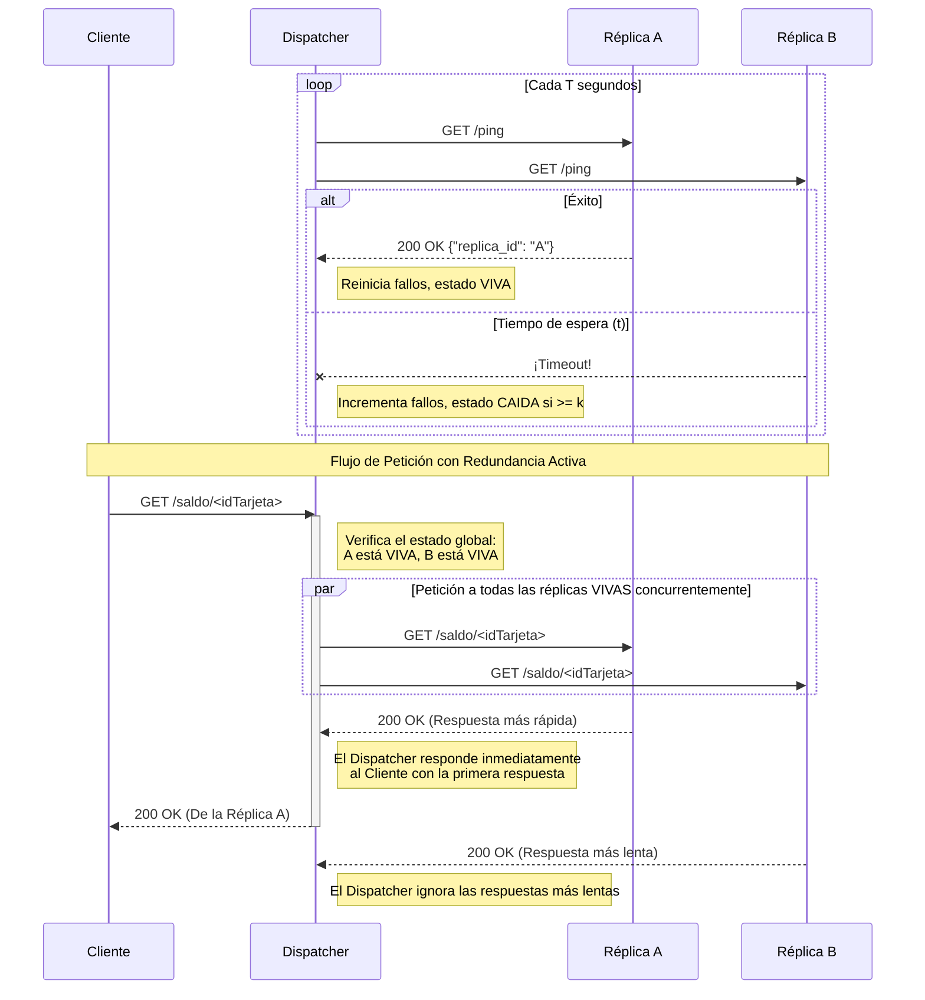

# Diagrama de Secuencia

Este diagrama ilustra los dos flujos principales de la arquitectura de alta disponibilidad:
1. **Monitor en Segundo Plano (Ping/Echo):** El Dispatcher sondea constantemente a las réplicas.
2. **Redundancia Activa:** El Dispatcher recibe una petición del cliente, consulta a todas las réplicas VIVAS en paralelo y retorna la respuesta más rápida.

